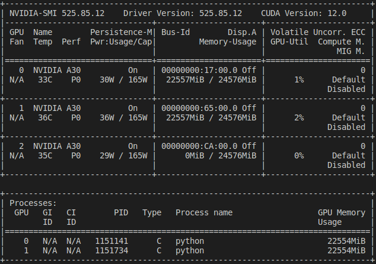

# EMSAssist

This repository contains the reproducible artifact for EMSAssist. We provide 3 ways to replicate the results in the EMSAssist paper: 1) replicate using a prebuilt docker image (recommended and provided); 2) replicate using a baremetal desktop/server machine with a decent NVIDIA GPU; 3) remote access (available upon request).

## 1. Basic requirement

EMSAssist artifact evaluation relies on some basic software and hardware environment as shown below. The environment versions listed here are the versions we have tested. Different versions with small gaps should work (e.g., Ubuntu Desktop 18 and NVIDIA 3080 should work). It's good to note the artifact evaluation does not neccessarily need an NVIDIA GPU, but a NVIDIA GPU will help a lot for the evaluation (e.g., huge evaluation time reduction). In the following, we assume you have a least 1 NVIDIA GPU.

| Software Environment  | Version |
| ------------- | ------------- |
| OS  | Ubuntu Server 20.04.1 LTS |
| NVIDIA Driver  | 525.85.12  |

| Hardware Environment  | Version |
| ------------- | ------------- |
| GPU  | 3 x NVIDIA A30   |
| CPU | 2 x Intel Xeon 4314 |
| Disk | require more than 200 GB |
| RAM | require more than 32GB |

Before evaluating and using the EMSAssist artifact, please make sure you have at least 1 NVIDIA GPU available with `nvidia-smi` command.




## 2. Replicate using a prebuilt docker image (recommended and provided)

The prebuilt docker image contains the neccessary software environment. We recommend using this option for the artifact evaluation. If you want to build the docker image on your own, please refer to the `build_docker.md` file in this repository.

Assuming NVIDIA GPUs present in the bare metal system running Ubuntu 22.04, we can start with artifact evaluation using prebuilt docker image

We first install docker and pull the docker image from dockerhub.

### 2.1 Install Docker on Bare Metal Machine

* Update and Install Docker:
```console
$ sudo apt update
$ sudo apt-get install docker
```

* Test Docker installation: (should show docker.service details.)
```console 
$ sudo systemctl status docker 
```
	
* Perform post installation steps to avoid sudo
```console
#Create the Docker group.
$ sudo groupadd docker

#Add your user to the Docker group
$ sudo usermod -aG docker $USER

#Activate the changes to groups
$ newgrp docker
```

### 2.2 Install Docker-Compose

```console
$ sudo apt update
$ sudo apt-get install docker-compose 
```

### 2.3 Install nvidia container tootlkit in local machine 

This toolkit allows you to connect the container engine to the bare metal machine's nvidia driver. This requires Docker dameon to reload.

```console
#enter the sudo user mode to add key and repository 
$ sudo -i
$ curl -s -L https://nvidia.github.io/nvidia-docker/gpgkey | apt-key add -
$ curl -s -L https://nvidia.github.io/nvidia-docker/ubuntu22.04/nvidia-docker.list > /etc/apt/sources.list.d/nvidia-docker.list
$ apt update
$ exit

#Install nvidia-container-toolkit
$ sudo apt -y install nvidia-container-toolkit

#Restart docker engine, this requires authentication
$ systemctl restart docker
```

### 2.4 Clone EMSAssist and clone tf examples inside EMSAssist

```console
$ git clone --recursive git@github.com:LENSS/EMSAssist.git`
$ cd EMSAssist
$ git clone --recursive git@github.com:tensorflow/examples.git
```

### 2.5 Download and decompress the data and model inside EMSAssist

Download the [data.tar.gz](https://drive.google.com/file/d/1Li-oA6ZfuHx2EbqGWbhK-sZvwgnHVJs9/view?usp=share_link), [model.tar.gz](https://drive.google.com/file/d/12LOuUl__T-oVMBQRLd8p7m27AiepQrSR/view?usp=share_link) files from Google Drive to the cuurent working (e.g., /home/$username/EMAssist) folder. We expect the downloading and decompressing to take 2-3 hours.

<!-- and [docker-compose.yml](https://drive.google.com/file/d/12LOuUl__T-oVMBQRLd8p7m27AiepQrSR/view?usp=share_link) -->

```console
#decompress model.tar.gz
$ tar -xvzf model.tar.gz

#decompress the data.tar.gz
$ tar -xvzf data.tar.gz

#correcting the data path, this is important
$ cd data/transcription_text/
$ python reconfig_data_path.py
$ cd ../..
```

With the steps above, we should have `data`, `model`, `examples`, `src`, `docker-compose.yml`， `requirements.txt` in `EMSAssist` folder.

### 2.6 Launch the docker

```console
#Run docker-compose in silent mode from EMSAssist folder. it will pull a docker container image and run it in bare metal machine as "emsassist"
$ docker-compose up -d
```

### 2.7 Login the docker

```console
$ docker exec -it emsassist /bin/bash
$ conda activate emsassist-gpu

#make sure you can see nvidia-device after you login the docker
$ nvidia-smi
```

Before we go to the specific directory to evaluate, we want to make sure the python path and library path are set up correctly (The two paths should already be set up).

* `echo $PYTHONPATH`

> /home/EMSAssist/src/speech_recognition:/home/EMSAssist/examples

* `echo $LD_LIBRARY_PATH`

> LD_LIBRARY_PATH=/opt/conda/envs/emsassist-gpu/lib:/usr/local/nvidia/lib:/usr/local/nvidia/lib64

If, in some cases, the paths above do not match what's shown above inside the container, please set it up when you are in the `EMSAssist` folder while you login into the container:

```console
export PYTHONPATH=$PWD/src/speech_recognition:$PWD/examples
export LD_LIBRARY_PATH=$CONDA_PREFIX/lib:$LD_LIBRARY_PATH
```


### 2.8 Begin the evaluation
```
#follow the README in the EMSAssist/src to continue the evaluation
$ cd src
```

## 3  Using bare metal machine 
First of all, we download anaconda for smoother artifact evaluation

* Download Anaconda installer: `wget https://repo.anaconda.com/archive/Anaconda3-2023.03-Linux-x86_64.sh`

* Run the installer: `bash Anaconda3-2023.03-Linux-x86_64.sh`. Keep pressing `Enter` or inputing `yes` on the command line

* Create a conda environment for EMSAssist: `conda create -n emsassist-gpu pip python=3.7`

* Activate the environment: `conda activate emsassist-gpu`

* Install the XGBoost-GPU: `conda install py-xgboost-gpu`. This also installs the CudaToolkit: pkgs/main/linux-64::cudatoolkit-10.0.130-0 

* Install the TensorFlow-2.9: `pip install tensorflow-gpu==2.9`

* Install the CUDA ToolKit 11.0 and CuDNN 8.0: `conda install -c conda-forge cudatoolkit=11.0 cudnn`

* Install the required python modules: `pip install -r requirements.txt`

### 3.1 Directory and path preparation

Before we proceed, please make sure you successfully set up the environment or get the Docker image running with `nvidia-smi`

* `git clone --recursive git@github.com:LENSS/EMSAssist.git`

* `cd EMSAssist`

* `git clone --recursive git@github.com:tensorflow/examples.git`

* `export PYTHONPATH=$PWD/src/speech_recognition:$PWD/examples`

* `export LD_LIBRARY_PATH=$CONDA_PREFIX/lib:$LD_LIBRARY_PATH`

* Download the [data.tar.gz](https://drive.google.com/file/d/1Li-oA6ZfuHx2EbqGWbhK-sZvwgnHVJs9/view?usp=share_link) and [model.tar.gz](https://drive.google.com/file/d/12LOuUl__T-oVMBQRLd8p7m27AiepQrSR/view?usp=share_link) tar files from Google Drive to the cuurent EMSAssist folder. We expect the downloading and decompressing to take 2-3 hours.

* decompress the `model.tar.gz`: `tar -xvzf model.tar.gz`

* decompress the `data.tar.gz`: `tar -xvzf data.tar.gz`. After this step, make sure we have 5 folders under `EMSAssist` directory: `src`, `examples`, `data`, `init_models` and `model`.

* begin the evaluation: `cd src`. Check out the README file when you enter each sub-directory.


<!-- we create and activate a conda environment with tensorflow-gpu: `conda activate tf-gpu` -->


<!-- ```
conda create -n xgb-gpu
conda activate xgb-gpu
conda install python=3.7
conda install py-xgboost-gpu
pip install tensorflow-gpu==2.9
```

`conda install -c conda-forge py-xgboost-gpu`

`mv /home/liuyi/anaconda3/lib/libstdc++.so.6.0.29 /home/liuyi/anaconda3/lib/libstdc++.so.6.0.29.old`

`ln -s /home/liuyi/anaconda3/envs/tf-gpu/lib/libstdc++.so.6.0.30 /home/liuyi/anaconda3/lib/libstdc++.so.6.0.29` -->
